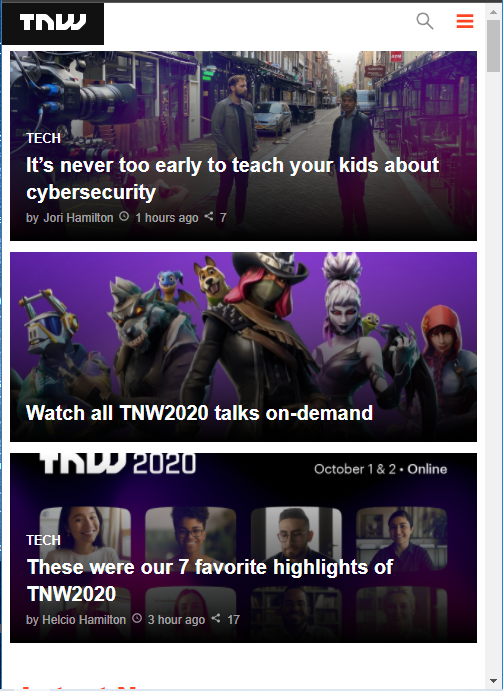
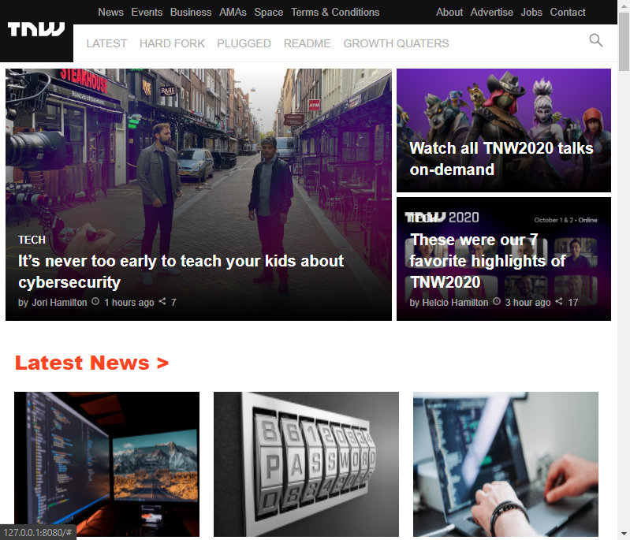

# The-Next-Web-Clone
This project consists of replicating the The Next Web website putting emphasis on how it behaves differently depending on the size of the screen where the website is rendered.

**Mobile view screenShot**

**Tablet view screenShot**

**Laptop view screenShot**

## Sample of The Next Web Page Website Clone with the following features:

- Navigation Bar
- Main section
- Articles
- Footer

## Built With

- 
- 

## Live Demo

[Live Demo Link](https://rawcdn.githack.com/ArreyTabe/The-Next-Web-Clone/1941cc49d7ebf69ba7d648d20aa8839709a43d23/index.html)

**See the page via the link above**

**See the Source Page via the link below**

[Source Page Link](https://thenextweb.com/)

## Authors

😎 **Helcio André**

- GitHub: [@helciodev](https://github.com/helciodev)
- Twitter: [@helcio_bruno](https://twitter.com/helcio_bruno)

👤 **Arrey Tabe**

- Github: [ArreyTabe](https://github.com/ArreyTabe)
- Twitter: [@tabe_arrey](https://twitter.com/tabe_arrey)
- LinkedIn: [Arrey Affuembey](https://www.linkedin.com/in/arrey-affuembey-80a8b11a8/)

## Show your support

Give a ⭐️ if you like this project!

## 📝 License

This project is [MIT](https://choosealicense.com/licenses/mit/) licensed.

